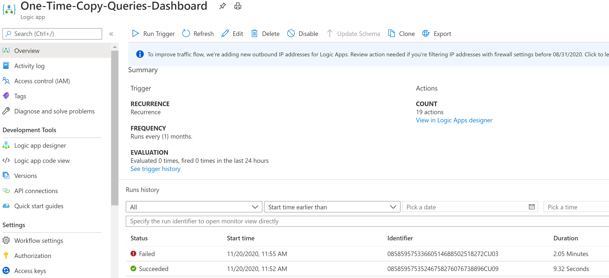
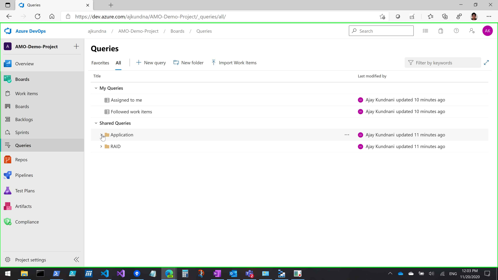
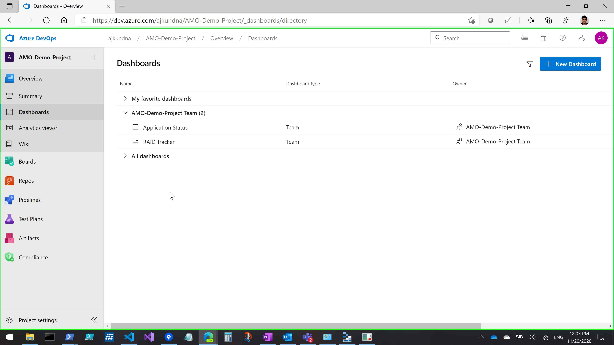
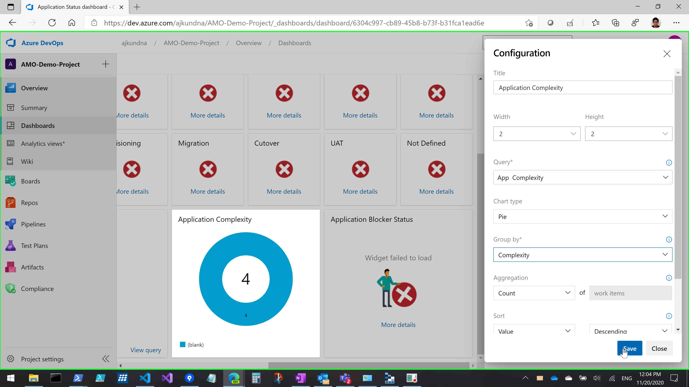
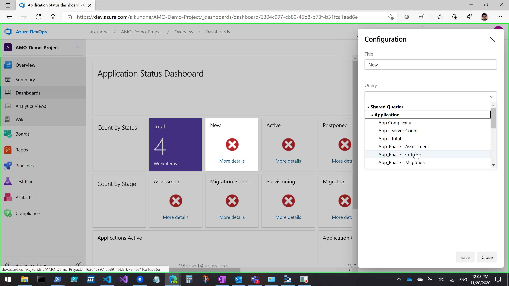

# Setup Native Reporting for Azure DevOps

## ADO Reporting

Version: 1.0

Last Modified: 3rd November 2020

#### Definitions

In this document, the following terms are used:

   Acronym/Term    |    Abbreviation / Definition
  -|-
  ADO   |   Azure DevOps
 ________________

 [[_TOC_]]

 ## Introduction
 This document walks you through on how to copy Shared queries and native ADO dashboards from offering demo tenant to your customer's Azure DevOps organization.

 ## Pre-Requisites
 Item   |   Description
 -|-
 MSFT Account   |   MSFT account which is part of group `Azure Migration Offering - Delivery`. This group has access to offering demo tenant
 Logic App `One-Time-Copy-Queries-Dashboard`    |   This logic app is deployed along with other logic apps. Ensure it's deployed correctly and ready to execute. Please deploy using [Logic Apps Automation Wiki](https://servicesdocs.visualstudio.com/Managed-Knowledge/_wiki/wikis/Azure%20Migration/6172/Logic-Apps-Automation)

 ## Deployment Steps
 Please follow below steps to deploy above ARM template in your subscription

 Step ID    |   Description |   Expected Output
 -|-|-
 1 |  Enable & Execute `One-Time-Copy-Queries-Dashboard`. Disable after executed once. Post-execution Shared queries will be created in default project team.  |  
 2 |  Browse to **Boards** -> **Queries** and Validate Shared queries in `Application` and `RAID` folder. |  
 3 |  Browse to **Overview** -> **Dashboards** and Validate dashboard `Application Status` and `RAID Tracker` created.  |  

 ## Configure Dashboard
 Due to change in shared query ID in target ADO Organization, the wudgets within dashboard will initially show up as disconnected. Please follow below steps to map query to corresponding widget.

 Step ID |  Description |  Expected Output
 -|-|-
 1 |  Click **...** -> **Configure** for specific widget. Under **Query** drop-down map the corresponding query as per below table. |  
 2 |  Repeat above step for all widgets associated with dashboard `Application Status` and `RAID Tracker`   |  

 

 ### Application Status Dashboard Query Map
 All queries associated with widgets are stored in `Application` folder.

 Widget Name   |  Shared Query
 -|-
 Total   |  App - Total
 New  |  App_State - New
 Active  |  App_State - Active
 Postponed  |  App-State_Postponed
 On-Hold |  App_State - On Hold
 Closed  |  App_State - Closed
 Removed |  App-State-Removed
 Assessment |  App_Phase - Assessment
 Migration Planning  |  App_Phase - Migration Planning
 Provisioning  |  App_Phase - Provisioning
 Migration  |  App_Phase - Migration
 Cutover |  App_Hase - Cutover
 UAT  |  App_Phase - Migration Acceptance Test
 Not Defined   |  App-Phase-NotDefined
 Applications Active |  App_State - Active
 Application Complexity |  App Complexity. Group by **Complexity**
 Application Blocker Status   |  App_State - On Hold. Group By **Migration Blocker Categories**

  

 ### RAID Tracker Dashboard Query Map
 All queries associated with widgets are stored in `RAID` folder.

 Widget Name   |  Shared Query
 -|-
 Critical Priority   |  RAID - Critical Priority
 High Priority |  RAID - High Priority
 Medium Priority  |  RAID - Medium Priority
 Low Priority  |  RAID - Low Priority
 Unassigned |  RAID - Unassigned
 Overdue 5+ Days  |  Overdue LT 5 days
 Due Today  |  RAID - Due Today
 Due within 5 days   |  RAID - Due within 5 days
 RAID - Open & Type Issue  |  RAID - Open & Type Issue