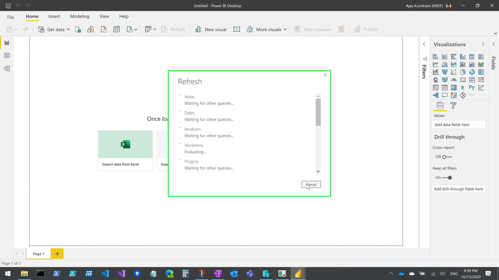
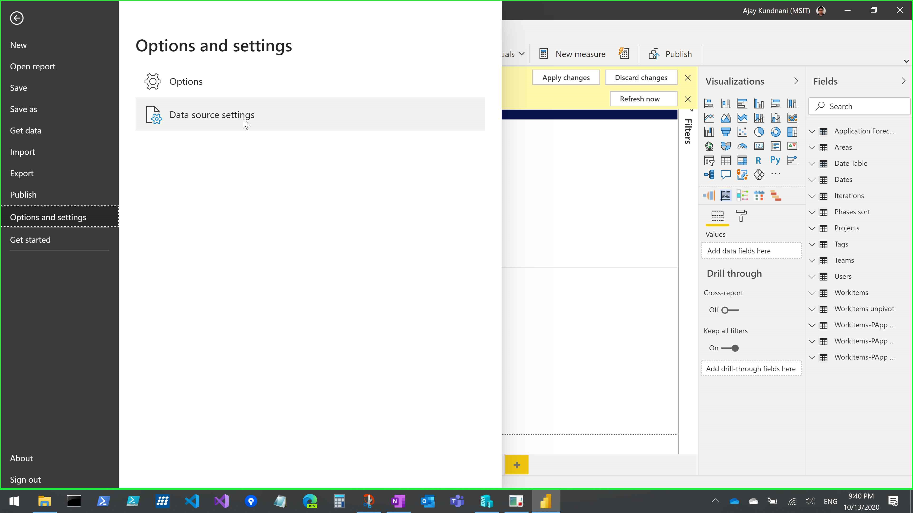
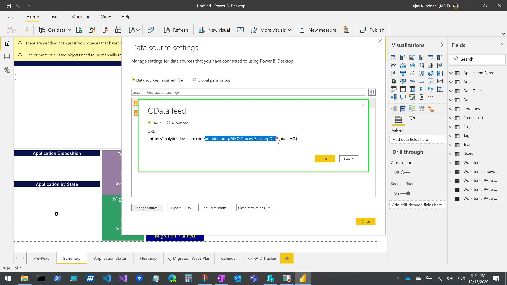
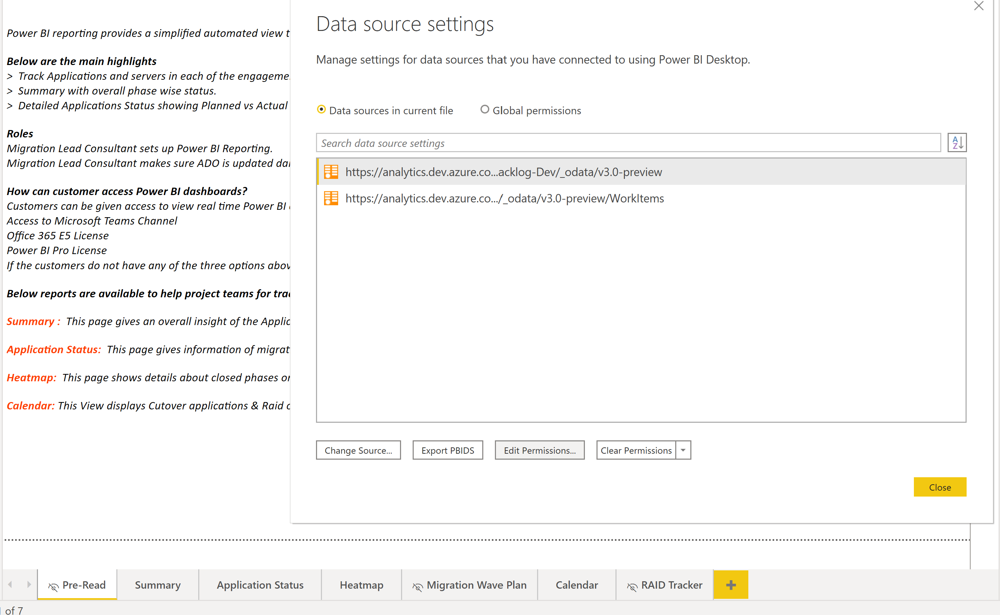
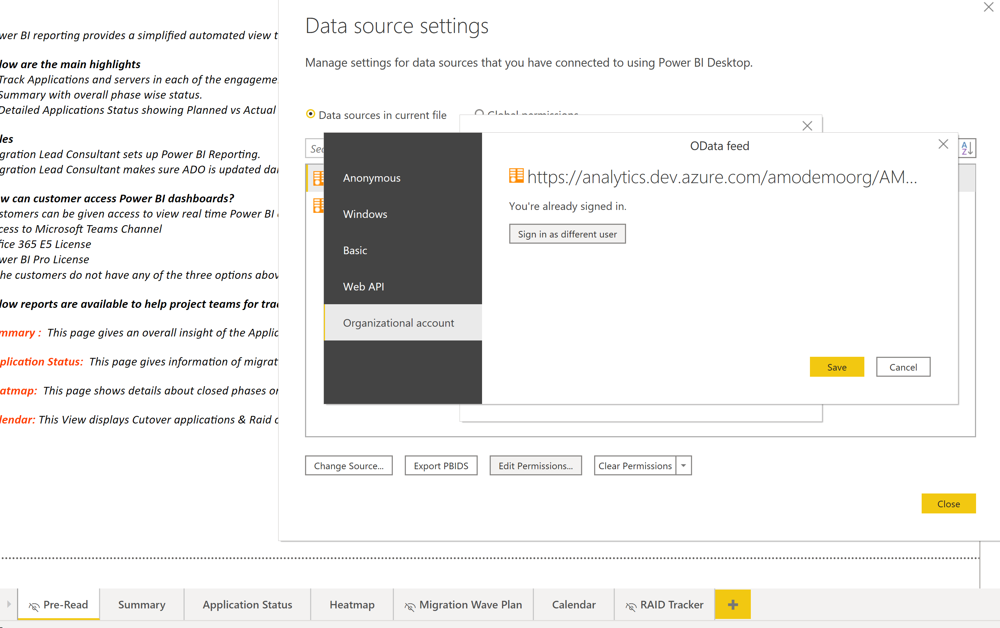
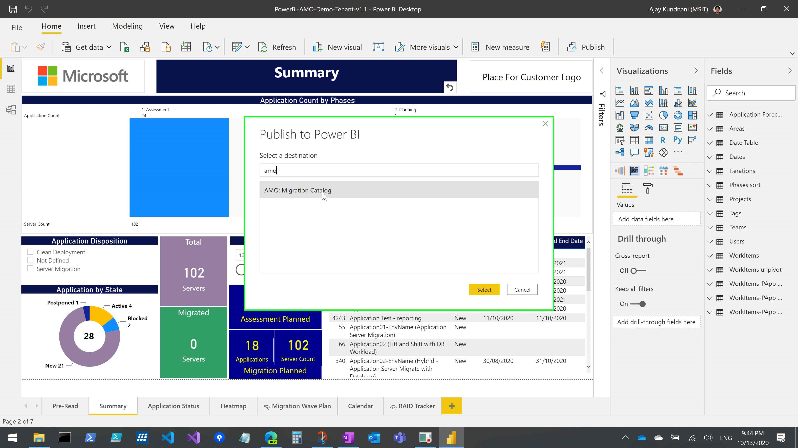

# Setup PowerBI Reporting for Azure DevOps

## ADO Reporting

Version: 1.0

Last Modified: 13th October 2020

#### Definitions

In this document, the following terms are used:

   Acronym/Term    |    Abbreviation / Definition
  -|-
  ADO   |   Azure DevOps
 ________________

 [[_TOC_]]

 ## Introduction
 This document walks you through on how to connect PowerBI template with your customer's Azure DevOps organization.

  ## Pre-Requisites
 Download the PowerBI Template created for Azure DevOps:
 
 File Name  |   Location
 -|-
 PowerBI-AMO-Template-v1.0.pbit  |  [PowerBI-AMO-Template-v1.0.pbit](https://cloudmouswprdsta01.blob.core.windows.net/logicappdeployment/Reporting/PowerBI-AMO-Template-v1.0.pbit)

  ## Deployment Steps
 Please follow below steps to deploy above ARM template in your subscription

 Step ID    |   Description |   Expected Output
 -|-|-
 1 |  Open the PowerBI `pbit` file downloaded and cancel initial query evaluation   |  
 2 |  Navigate to `File -> Options and Settings - Data Source Settings` |  
 3 |  Select first URL and click on `Change Source`. Update the `OrganizationName/ProjectName` in the URL highlighted in screenshot |  
 4 |  Repeat `Step 3` for second URL as well |   
 5 |  Once done, click `Edit Permissions` for first URL   |  
 6 |  Click `Edit` and use `Sign-In` option to sign-in using credentials with access to Azure DevOps project, click `Save` once signed in |  
 7 |  You might get warning in one of query as shown which can be safely ignored |  
 8 |  Update the `Customer Logo` in top-right of PowerBI file which reads `Place for Customer Logo`   |  
 9 |  `Save` your changea and now You're now ready to `Publish` the PowerBI report to Teams workspace and add `Power BI` connector to your project teams channel. Refer to section `References` for more details on same |  

## Frequently asked questions
1. Is ADO Dashboard better use-case over PowerBI?
 ADO native dashboard capabilities are not as flexible as PowerBI service for Azure DevOps.

2. I see difference in data shown in PowerBI vs ADO dashboard.
 ADO Dashboards update real-time as you change state of work items where-as PowerBI run on schedule, hence you can observe difference in reports based on when PowerBI data was last refreshed.

3. How frequently does PowerBI data refreshes?
 By default PowerBI refreshes once a day. You can increase the frequency of schedule, please refer to `References` section below for same. 
   >**Note**: Recommended to keep maximum schedules to `4` above which you can notice refresh failures due to Azure DevOps throttling.

 ## References
 - [Publish datasets and reports from Power BI Desktop](https://docs.microsoft.com/en-us/power-bi/create-reports/desktop-upload-desktop-files#:~:text=In%20Power%20BI%20Desktop%2C%20choose%20File%20%3E%20Publish,the%20workspace%20into%20which%20you%20want%20to%20publish.)
 - [Embed Power BI content in Microsoft Teams](https://docs.microsoft.com/en-us/power-bi/collaborate-share/service-embed-report-microsoft-teams)
 - [Configure Scheduled Refresh in PowerBI](https://docs.microsoft.com/en-us/power-bi/connect-data/refresh-scheduled-refresh)